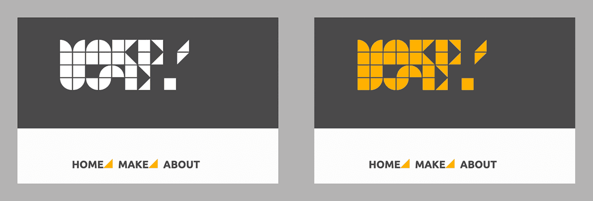

# MakeUse | Zero-Waste Fashion | Studio Helper App

[View the live website here.](https://thomasmcquillan.github.io/MakeUse/index.html)

Created for makeuse.nz, this project is a reimagining of the 'MAKE' pages from their existing website. The Make/Use site is an online toolset and education hub for Zero-Waste Fashion, launched alongside an exhibition and workshop series. The existing site's MAKE pages each document the required steps, materials and patterns needed to re-create garments featured in the exhibition. The resources are rich in detail but can take some effort to decipher exactly which pattern pieces and downloads are needed to create selected style - and how the finished garment may look. 

This project seeks to streamline the delivery of these resources to improve the user experience and further engage site visitors. Adopting the Make/Use Cropped Tshirt, Long-Tshirt and Long-Coat as pilot project, the existing pages' text-based instructions and download links are embellished with interactive elements and a new 'Maker' tool. The Maker allows users to switch styles of neckline, body and sleeves to suit their tastes. User modifications to the garment model are mirrored in updated fabric size requirements and a filtered download list.

   

<!-- 

    

 -->

## User Experience (UX)
 

* ## User Stories

    * ### First time visitor goals

        * As a first time visitor to Make/Use I would like to learn about zero-waste fashion, and what is the motivation for adopting zero-waste thinking when designing and making clothes.

        * As a first time visitor I want to be provided with easy navigation to the information and resources I need to start making my own garments.

        * As a first time visitor I would like to see visual examples of what kinds of styles are possible when designing zero-waste fashion garments.

        * As a first time visitor I would like some way of customising the Make/Use garments to suit my taste and / or body shape.

        * As a first time site visitor I would like to know how much fabric I will require to sew my selected style.

        * As a first time visitor I would like it to be clear what downloads I need for my selected style, and an easy way of downloading them.

        * As a first time site visitor it would be helpful if I could be emailed the instructions on how to make my chosen garment for easy reference.

        * As a first time visitor I expect a site that displays well across devices and is intuitive to use and navigate.

    * ### Returning Visitor Goals

        * As a returning visitor I would like to attempt a new modification of the design and gather the appropriate resources to do so.

    * ### Frequent Visitor Goals

        * As a frequent visitor to the Make/Use site, it would be nice to see more garments from the Make/Use collection added to the template 'Maker Tool' to enable easier visualisation of those garments' possible modifications.

   

* ## Client Stories

    * ### Client Goals

        * As the Creator and Project Lead for MakeUse I would like to reduce the number of emails I receive from site visitors, asking questions about which downloads they need to create the garments shown.

        * As the client I would like to see a better balance of text and supporting images.

        * As the client I want the new page to match the aesthetic of the rest of the MakeUse site, including colors, fonts, branding etc.

        * As the client, it is important that page navigation is intuitive and that all links and functions work as intended.

        * As the client, it is important that the code is structured clearly so that it can serve as a template for bringing the same functionality to the other garments on the MakeUse site.

## Design

* ### Colour Scheme

    * Given that the project is a reimagining of existing pages on a live website it is important that the color scheme matches the rest of the site. Key colors have been borrowed from the site's existing CSS styles and applied in a manner consistent with the aesthetic of the existing website. 

    * The color scheme is also applied in subtle ways, such as CSS hover states for navigation links (as pictured below) and jQuery 'mouse-over' event listeners for interactivity. One example is the garment tiles changing opacity when hovered to hint that the tile can be clicked on.

 

    

 

* ### Typography
    * For consistency with MakeUse website, my project uses 'Ubuntu', and 'MakeUse' typefaces.

    * I sourced Ubuntu from Google Fonts. It is used for the majority of text elements across the site, including body, links and headings etc.

    * MakeUse font is a bespoke typeface created for the project by designers, Jo Bailey and Thomas Le Bas. In my project the Make/Use font is not used as a typeface as such, but rather it features in the Make/Use logo, at the top-left of the header / navigation bar. As part of the Make/Use project, the font was made available open-source and can be downloaded here:
    [Make/Use font](assets/fonts/makeuse-icons.woff)

* ### Imagery
    * Make/Use video shown on landing page directed by Jason O'Hara and edited by Mon Patel. Modelling by Hannah Dellow. Garments by Holly McQuillan, Textiles by Greta Menzies.

    * Interactive 3D / AR garment models provided by Holly McQuillan.

    * Photographs on the site courtesy of Bonny Stewart-MacDonald. 
    
    * Interactive garment tiles 3d-rendered in Clo3d software before being exported as 2d image tiles by Holly McQuillan. Garment tile assets resampled, reordered and renamed by Thomas McQuillan.

 

## Wireframes

* I made the wireframes for the project using Adobe XD.

 

*   # User Journey

<!-- Existing page: https://makeuse.nz/make/crop-t-shirt/ -->

    

## Features
The existing website's 'Make' pages have been stripped down and rebuilt, considering the user's journey when setting out to make a given garment. This saw the creation of a bespoke interactive garment model that changes as the user clicks the neckline, body or sleeve tiles. 

<!-- <image width="77%" src="assets/documentation/readme-assets/makeuse-font.png"></image> -->

* As the garment tiles change, the stated fabric size requirement updates to account for the changes in pattern size and shape.

* Changes to the garment also provides users with key garment measurements for the style currently displayed. This gives users a sense of the displayed garment's proportions which provides a reference point that they can compare with their own needs.

* For seasoned sewists there is now the option of entering custom values for garment length, garment circumference and sleeve circumference. While input values will not be represented in the garment displayed (as the variations are endless), it provides an easy way of determining how much fabric they will need based on their specific requirements.

* Additionally, with each tile change the list of template downloads is filtered to only show the files needed for the garment configuration that is currently displayed. This seeks to avoid overwhelming the user with a long list of downloads to sort through, thereby reducing cognitive load. The relevant downloads are displayed both as thumbnail images and text-links. This is to familiarise the user with the templates themselves and to provide a more visual and engaging experience.

    * The template thumbnails toggle on and off as their associated garment tile toggles on and off. Some of the more basic garment configurations require relatively few templates, while more ambitious modifications require more template downloads in addition to the core templates required for all designs.
    
    * When a user hovers over the template thumbnails a larger preview is displayed to show the template in more detail. If a user would like to see it larger again, the original pdf file can be opened in a new tab simply by clicking the thumbnail.

    * When a user hovers over a tile on the garment model, the associated template thumbnail changes color. The concept is to help users begin to understand the template system and start 'joining the dots' in their head as to which templates are related to the various parts of the garment.

    * Template downloads are also displayed as a dynamic list, which updates as the garment configuration changes. While users can, if desired, open and download the pdf template files by opening thumbnails in a new tab - this is not the conventional way of downloading files. Therefore regular text anchor links are also provided. I have added the HTML5 download attribute to the anchor tags, so that once users are happy with their garment they can simply left-click on the links to download.

* To view detailed instructions on garment construction users have two options:

    1)  Navigate to a separate page to view instructions.

        or

    2)  Enter their name and email address to have the instructions sent directly to their mailbox for easy reference.

* If opting to have the instructions emailed, the garment page that the user is on at the time will determine which instructions they receive. This is achieved through EmailJS custom templates, linked in the head of each Maker page. At launch, there are 3 garments - 2 tshirts and a coat. As the Cropped Tshirt and Long Tshirt are constructed by the same method, their instructions are covered by one template and the coat by another. The email also contains a link back to the Make/Use page for an easy way to navigate back to the site to check measurements, download files or come up with a whole new design.

* The page has been designed to be responsive across devices from small mobile devices to tablets and desktops. The best experience however is when viewed on desktop computers for various reasons:

    * The interactive garment model is a larger size, so easier to see and clicking tiles is less fiddly.

    * The Maker tools' many reactive hover states are not available without a pointing device.

    * The dynamic elements such as template thumbnails, fabric required / garment-measurements, and download links are usually in view when viewed on a desktop or tablet. This gives a tangible feeling of interactivity that can be lacking when viewed on smaller handheld devices. 

    * Additionally, mobile users are unlikely to want to download pdf template files to their mobile. Fortunately they can still have the instructions emailed to them, which contains a link back to the page for when they get to their computer or tablet.

## Technologies Used
### Languages Used
* [HTML5](https://en.wikipedia.org/wiki/HTML5)
* [CSS3](https://en.wikipedia.org/wiki/Cascading_Style_Sheets)
* [JQuery](https://en.wikipedia.org/wiki/JQuery)

### Frameworks, Libraries and Programs Used
1. [Bootstrap 5.1.3](https://getbootstrap.com/docs/4.6/getting-started/introduction/)
* Bootstrap was used to style key page elements such as the navigation bar and for its responsive layout features including row, column and card classes.
2. [Google Fonts](https://fonts.google.com/)
* Google Fonts was used to embed the Ubuntu typeface that is used throughout the existing MakeUse site.
3. [Adobe Color](https://color.adobe.com/)
* Adobe Color was used when considering the color-scheme. This helped with matching my page to the rest of the MakeUse site.
4. [Adobe Photoshop](https://www.adobe.com/products/photoshop.html)
* Adobe Photoshop was used in the editing, resampling and export of the project's vast collection of image assets.
5. [jQuery](https://jquery.com/)
* jQuery was used extensively for declaring variables and calling functions. Also used for Javascript's smooth scroll function.
6. [Git](https://git-scm.com/)
* Git was utilised for version control via the Gitpod terminal for commiting file changes to Git before pushing to the GitHub repository.
7. [GitHub](https://github.com/)
* GitHub provided a place to store the projects various files and assets after being commited and pushed from Git.
8. [Adobe XD](https://www.adobe.com/products/xd.html)
* Adobe XD was used to create the wireframes for the initial design, to show the layout and basic site elements.
9. [EmailJS](https://www.emailjs.com/)
* EmailJS was used for ....

## Testing

* ### W3C Markup Validator W3C CSS Validator

    * [W3C Markup Validator](https://jigsaw.w3.org/css-validator/#validate_by_input)

        * [Results:](https://validator.w3.org/nu/_____.html)
     
    * [W3C CSS Validator](https://jigsaw.w3.org/css-validator/#validate_by_input)
        
        * [Results:](https://jigsaw.w3.org/css-validator/)

    * [JSHint javascript code validator](https://jshint.com/)
        
        * [Results:](assets/documentation/jshint-javascript-validator-results-makeuse.html)
 

* ### Testing User Stories from User Experience (UX) Section 

* #### First Time Visitor Goals
    

    "As a first time visitor to Make/Use I would like to learn about zero-waste fashion, and what is the motivation for adopting zero-waste thinking when designing and making clothes."

    "As a first time visitor I want to be provided with easy navigation to the information and resources I need to start making my own garments."

    "As a first time visitor I would like to see visual examples of what kinds of styles are possible when designing zero-waste fashion garments."

    "As a first time visitor I would like some way of customising the Make/Use garments to suit my taste and / or body shape."

    "As a first time site visitor I would like to know how much fabric I will require to sew my selected style."

    "As a first time visitor I would like it to be clear what downloads I need for my selected style, and an easy way of downloading them."

    "As a first time site visitor it would be helpful if I could be emailed the instructions on how to make my chosen garment for easy reference."

    "As a first time visitor I expect a site that displays well across devices and is intuitive to use and navigate."

    * #### ".."
 
        * Upon arrival at the site....
 
    * #### "As a first time visitor, ..."
        * Upon arrival at the site...
 
    * #### "As a first time visitor, ...
 
        * The site ...
 
    * #### "As a first time visitor, ..."
 
        * 
    
    * #### "As a first time visitor, ..."
 
        * 
 
    * #### "As a first time visitor I would like any downloads to open in a separate window/tab to avoid accidental navigation away from the site."
 
        * All downloads are instructed to open in a new tab using the target="_blank" syntax.

* #### Returning Visitor Goals
    * #### "As a returning visitor, ..
        
        * ....

    * #### "..
            
        * ..

* #### Client Goals

    * #### "."
         
        * ....
