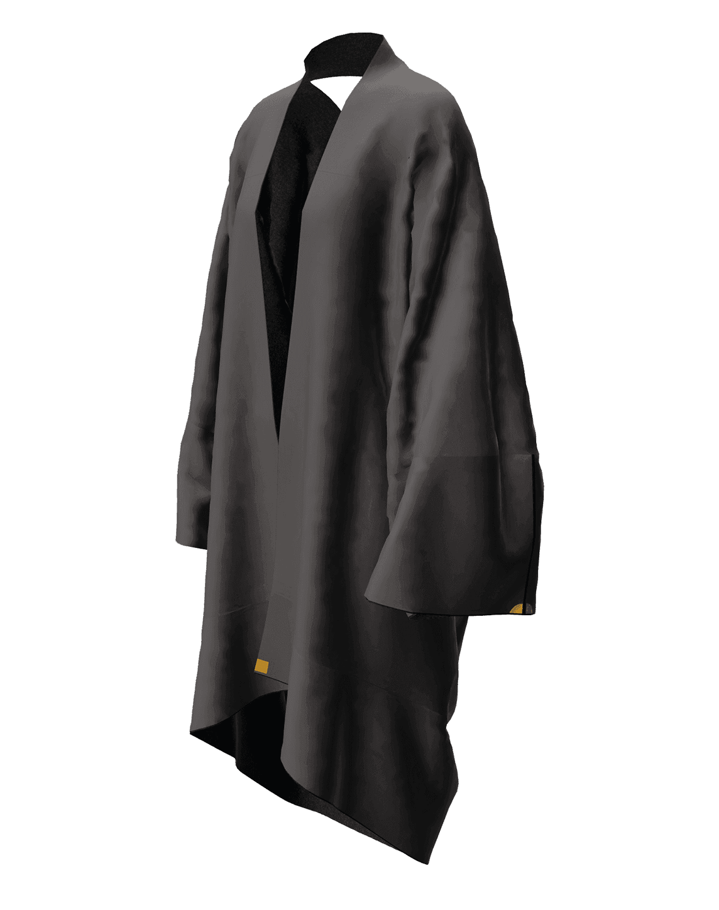

# Make/Use | Maker* Zero-Waste Fashion Toolkit

 

[View the live website here.](https://thomasmcquillan.github.io/MakeUse/index.html)

 
Created for makeuse.nz, this project is a reimagining of the 'MAKE' pages from their existing website. The Make/Use site is an online toolset and education hub for Zero-Waste Fashion, launched alongside an exhibition and workshop series. The existing site's MAKE pages each document the required steps, materials and patterns needed to re-create garments featured in the exhibition. The resources are rich in detail but can take some effort by site visitors to decipher exactly which pattern pieces and downloads are needed to create selected style - and how the finished garment may look. 
  
This project seeks to streamline the delivery of these resources to improve the user experience and further engage site visitors. Adopting the Make/Use Cropped Tshirt, Long-Tshirt and Long-Coat as pilot project, the existing pages' text-based instructions and download links are embellished with interactive elements and a new 'Maker' tool. The Maker allows users to switch styles of neckline, body and sleeves to suit their tastes. User modifications to the garment model are mirrored in updated fabric size requirements and a filtered download list.

  

## User Experience (UX)
 

* ## User Stories

    * ### First time visitor goals

        * As a first time visitor to Make/Use I would like to learn about zero-waste fashion, and what is the motivation for adopting zero-waste thinking when designing and making clothes.

        * As a first time visitor I want to be provided with easy navigation to the information and resources I need to start making my own garments.

        * As a first time visitor I would like to see visual examples of what kinds of styles are possible when designing zero-waste fashion garments.

        * As a first time visitor I would like some way of customising the Make/Use garments to suit my taste and / or body shape.

        * As a first time site visitor I would like to know how much fabric I will require to sew my selected style.

        * As a first time visitor I would like it to be clear what downloads I need for my selected style, and an easy way of downloading them.

        * As a first time site visitor it would be helpful if I could be emailed the instructions on how to make my chosen garment for easy reference.

        * As a first time visitor I expect a site that displays well across devices and is intuitive to use and navigate.

    * ### Returning Visitor Goals

        * As a returning visitor I would like to attempt a new modification of the design and gather the appropriate resources to do so.

    * ### Frequent Visitor Goals

        * As a frequent visitor to the Make/Use site, it would be nice to see more garments from the Make/Use collection added to the template 'Maker Tool' to enable easier visualisation of those garments' possible modifications.

   

* ## Client Stories

    * ### Client Goals

        * As the Creator and Project Lead for MakeUse I would like to reduce the number of emails I receive from site visitors, asking questions about which downloads they need to create the garments shown.

        * As the client I would like to see a better balance of text and supporting images.

        * As the client I want the new page to match the aesthetic of the rest of the MakeUse site, including colors, fonts, branding etc.

## Design

* ### Colour Scheme

    * Given that the project is a reimagining of existing pages on a live website it is important that the color scheme matches the rest of the site. Key colors have been borrowed from the site's existing CSS styles and applied in a manner consistent with the aesthetic of the existing website. The existing makeuse site can be viewed here: [makeuse.nz](https://makeuse.nz/make/crop-t-shirt/))

    * The color scheme is also applied in subtle ways, such as CSS hover states for navigation links (as pictured below) and jQuery 'mouse-over' event listeners for interactivity. One example is the garment tiles changing opacity when hovered to hint that the tile can be clicked on.

*   ### Wireframes

* I made the wireframes for the project using Adobe Photoshop. The project scope creeped a lot along the journey as I slowly grew in confidence with Javascript and jquery etc.
 

 

* ### Typography
    * For consistency with MakeUse website, my project uses 'Ubuntu', and 'MakeUse' typefaces.

    * I sourced Ubuntu from Google Fonts. It is used for the majority of text elements across the site, including body, links and headings etc.

    * MakeUse font is a bespoke typeface created for the project by designers, Jo Bailey and Thomas Le Bas. In my project the Make/Use font is not used as a typeface as such, but rather it features in the Make/Use logo, at the top-left of the header / navigation bar. As part of the Make/Use project, the font was made available open-source and can be downloaded here:
     

[Make/Use font](assets/fonts/makeuse-icons.woff)

 
 

* ### Imagery

    * Make/Use concept video on landing page directed by Jason O'Hara and edited by Mon Patel. Modelling by Hannah Dellow. Garments by Holly McQuillan, Textiles by Greta Menzies.

    * Interactive 3D / AR garment models provided by Holly McQuillan.

    * Photographs on the site courtesy of Bonny Stewart-MacDonald. 
    
    * Interactive garment tiles 3d-rendered in Clo3d software before being exported as 2d image tiles by Holly McQuillan. Garment tile assets resampled, reordered and renamed by Thomas McQuillan.

 
 

   

*   # User Journey

## Features

The existing website's 'Make' pages have been stripped down and rebuilt, considering the user's journey when setting out to make a given garment. This saw the creation of a bespoke interactive garment model that changes as the user clicks the neckline, body or sleeve tiles. 

* As the garment tiles change, the stated fabric size requirement updates to account for the changes in pattern size and shape.

* Changes to the garment also provides users with key garment measurements for the style currently displayed. This gives users a sense of the displayed garment's proportions which provides a reference point that they can compare with their own needs.

* For seasoned sewists there is now the option of entering custom values for garment length, garment circumference and sleeve circumference. While input values will not be represented in the garment displayed (as the variations are endless), it provides an easy way of determining how much fabric they will need based on their specific requirements.

* Additionally, with each tile change the list of template downloads is filtered to only show the files needed for the garment configuration that is currently displayed. This seeks to avoid overwhelming the user with a long list of downloads to sort through, thereby reducing cognitive load. The relevant downloads are displayed both as thumbnail images and text-links. This is to familiarise the user with the templates themselves and to provide a more visual and engaging experience.

    * The template thumbnails toggle on and off as their associated garment tile toggles on and off. Some of the more basic garment configurations require relatively few templates, while more ambitious modifications require more template downloads in addition to the core templates required for all designs.
    
    * When a user hovers over the template thumbnails a larger preview is displayed to show the template in more detail. If a user would like to see it larger again, the original pdf file can be opened in a new tab simply by clicking the thumbnail.

    * When a user hovers over a tile on the garment model, the associated template thumbnail changes color. The concept is to help users begin to understand the template system and start 'joining the dots' in their head as to which templates are related to the various parts of the garment.

    * Template downloads are also displayed as a dynamic list, which updates as the garment configuration changes. While users can, if desired, open and download the pdf template files by opening thumbnails in a new tab - this is not the conventional way of downloading files. Therefore regular text anchor links are also provided. I have added the HTML5 download attribute to the anchor tags, so that once users are happy with their garment they can simply left-click on the links to download.

* To view detailed instructions on garment construction users have two options:

    1)  Navigate to a separate page to view instructions.

        or

    2)  Enter their name and email address to have the instructions sent directly to their mailbox for easy reference.

* If opting to have the instructions emailed, the garment page that the user is on at the time will determine which instructions they receive. This is achieved through EmailJS custom templates, linked in the head of each Maker page. At launch, there are 3 garments - 2 tshirts and a coat. As the Cropped Tshirt and Long Tshirt are constructed by the same method, their instructions are covered by one template and the coat by another. The email also contains a link back to the Make/Use page for an easy way to navigate back to the site to check measurements, download files or come up with a whole new design.

* The page has been designed to be responsive across devices from small mobile devices to tablets and desktops. The best experience however is when viewed on desktop computers for various reasons:

    * The interactive garment model is a larger size, so easier to see and clicking tiles is less fiddly.

    * The Maker tools' many reactive hover states are not available without a pointing device.

    * The dynamic elements such as template thumbnails, fabric required / garment-measurements, and download links are usually in view when viewed on a desktop or tablet. This gives a tangible feeling of interactivity that can be lacking when viewed on smaller handheld devices. 

    * Additionally, mobile users are unlikely to want to download pdf template files to their mobile. Fortunately they can still have the instructions emailed to them, which contains a link back to the page for when they get to their computer or tablet.

## Technologies Used
### Languages Used
* [HTML5](https://en.wikipedia.org/wiki/HTML5)
* [CSS3](https://en.wikipedia.org/wiki/Cascading_Style_Sheets)
* [JQuery](https://en.wikipedia.org/wiki/JQuery)
* [json)]

### Frameworks, Libraries and Programs Used
1. [Bootstrap 5.1.3](https://getbootstrap.com/docs/4.6/getting-started/introduction/)
* Bootstrap was used to style key page elements such as the navigation bar and for its responsive layout features including row, column and card classes.
2. [Google Fonts](https://fonts.google.com/)
* Google Fonts was used to embed the Ubuntu typeface that is used throughout the existing MakeUse site.
3. [Adobe Color](https://color.adobe.com/)
* Adobe Color was used when considering the color-scheme. This helped with matching my page to the rest of the MakeUse site.
4. [Adobe Photoshop](https://www.adobe.com/products/photoshop.html)
* Adobe Photoshop was used in the editing, resampling and export of the project's vast collection of image assets.
5. [jQuery](https://jquery.com/)
* jQuery was used extensively for declaring variables and calling functions. Also used for Javascript's smooth scroll function.
6. [Git](https://git-scm.com/)
* Git was utilised for version control via the Gitpod terminal for commiting file changes to Git before pushing to the GitHub repository.
7. [GitHub](https://github.com/)
* GitHub provided a place to store the projects various files and assets after being commited and pushed from Git.
8. [Adobe XD](https://www.adobe.com/products/xd.html)
* Adobe XD was used to create the wireframes for the initial design, to show the layout and basic site elements.
9. [EmailJS](https://www.emailjs.com/)
* EmailJS was used for their email Templates, used to respond to form submissions on the site with an automatic response message and attached pdf garment sewing instructions.
10. [VNTANA](https://www.vntana.com/resource/3d-webviewer/) Vntana was used for their iframe hosting of the 3D / AR garment models, as rendered by my wife Holly.
11.[Vimeo](https://vimeo.com/143947170)Vimeo hosted the Make/Use video that is linked on the Articles page. The version on the landing page is a shorter edit that I made.

## Testing

## Further Testing
* The site was tested on different browsers including Google Chrome, Mozilla Firefox and Safari.
* I accessed the site several devices, with varying display sizes, resolutions and viewport-widths, from the old iPhone SE, the new iPhone SE, MacBook 13" macbook, right up to a 27" 4k monitor. The phones did well with the web pages and 3d model / AR, but a laptop or desktop computer is really best when using the Maker toolkit. There is room to further improve the resposivity of the 'Maker' app.
* Extensive testing was carried out to check that all navigation links to site pages, external sites, emailJS and downloadable content were functioning correctly.
* Close scrutiny was paid to each page to ensure that no spelling errors or typos were made.
* Friends and family members were asked to look through the site and associated documentation to give feedback and report on any bugs. 

## Lighthouse Testing 
* I had completed a number of performance, accessibility and best practices site assessments in the past week.  With the addition of various meta tags to the html head and alt and aria tags to content and navigation 
elements I was able to consistently score in the 90s. However, given that I have added a number of extra image assets and moved things around a bit I decided it was appropriate to have another try.
Interestingly the Index page which has a rotating slider animation was no problem for the simulated mobile test, even beating the desktop.  My the image elements on my latest project 
gallery were entirely populated from custom scaled image assets that I exported in Photoshop.  These I delivered in an srcset. It was satisfying to see lighthouse race through the test
for the new page.

* ### W3C Markup Validator W3C CSS Validator

    * [W3C Markup Validator](https://jigsaw.w3.org/css-validator/#validate_by_input)

        * [Results:](https://validator.w3.org/nu/_____.html)
     
    * [W3C CSS Validator](https://jigsaw.w3.org/css-validator/#validate_by_input)
        
        * [Results:](https://jigsaw.w3.org/css-validator/)

    * [JSHint javascript code validator](https://jshint.com/)
        
        * [Results:](assets/documentation/jshint-javascript-validator-results-makeuse.html)
 
 
* ## Testing User Stories from User Experience (UX) Section 

* ### First Time Visitor Goals

#### "As a first time visitor to Make/Use I would like to learn about zero-waste fashion and the motivations behind the movement."      
* The site is packed with information about Zero-Waste Fashion.  The 'about' page has an introduction to zero-waste fashion
    and the rationale behind the movement and the Make/Use Project. The 'Make' page talks further about some of the zero-waste garments that form part of the exhibition and now the website. Furthermore, the 'articles' page has a short video showing the process of designing a garment  virtually in the CLO3D software package. 

#### "As a first time visitor to Make/Use I would like to learn about zero-waste fashion."

* From the moment that visitors arrive at the new site's landing page there is a full-width header at the top of the page with navigation links. Just under the header to the left of the screen there is a quick navigation with diret links to the maker toolkit that I developed for the project.
        
  
    
#### "As a first time visitor I want to be provided with easy navigation to the information and resources I need to start making my own garments."

* From the moment that visitors arrive at the new site's landing page there is a full width header at the top of the page with navigation links. Just under the header to the left of the screen there is a quick navigation with diret links to the maker toolkit that I developed for the project.
 
  

#### "As a first time visitor I would like to see visual examples of what kinds of styles are possible when designing zero-waste fashion garments."
        
* As soon as you reach the landing page you are greeted with an experimental concept video that shows several pieces of the Make / Use garment collection in a playful dance with the dancer. The clothes appear to dress her themselves. Once inside the site there is ample visual evidence of the vast scope that zero waste design and the MakeUse Template system of pattern-making and sewing is capable of. Furthermore, there are three interactive 3d garment models that represent the three garments that were used when building the new site pages and template 'maker' tool.  These are presented as embedded iframes on the 'articles' page, and can even be experienced in Augmented Reality by site visitors.

#### "As a first time visitor I would like some way of customising the Make/Use garments to suit my taste and / or body shape."

* The new Maker tool that I built for the project allows an easy and engaging interactive means by which to 'imagine' some of the endless possible combinations of body, sleeve and neckline styles. This helps to visualise early on in the design stage which is reassuring for users, and reduces the risk of surprise or disappointment when it comes to making the garment. In addition, I have added a javascript function to allow users to calculate their fabric needs when using the maker tool. 

#### "As a first time site visitor I would like to know how much fabric I will require to sew my selected style."
        
* The new Maker tool updates the fabric requirements as users cycle through the garment tiles. Not every change in tile will result in a change to fabric requirements, as some of the styles are simply modifications - and use the same amount of fabric - just sewn in an alternate method.

#### " As a first time visitor I would like it to be clear what downloads I need for my selected style, and an easy way of downloading them."

* A key improvement to the site has been the automatic filtering of downloads to the specific files needed for a given garment configuration. This was programmed in javascript functions that toggle on and off tiles / images and anchor links in time with the relevant garment styles.  There are many moving parts to the tool, but it was worth it to be able to unburden aspiring fashion folk the cognitive load of figuring it all out for themselves.  I have also added code to the download anchor tags to make them download on a single mouse click.

#### "As a first time site visitor it would be helpful if I could be emailed the instructions on how to make my chosen garment for easy reference."

* There is now an emailjs script attached to the head of the garment pages that can send users instructions on how to make the garments using the template system.  It is optional, as there is also a link to the files on the make page. If a user enters their name and email address they receive an email with attached pdf instructions. If they are on the page for the coat when they fill out the form they will be sent the coat instructions, or if on either of the tshirt pages they will receive instructions for those.
        
#### " As a first time visitor I expect a site that displays well across devices and is intuitive to use and navigate."

* The site pages have been carefully designed to be responsive across various viewport widths. The Maker tool, while  still useable on smaller mobile devices, is much better suited to tablets and desktop use so that you can see more of the dynamic variables changing as you cycle through garment tiles. It also has a number of hover states and subtle animations that aren't available to touch screen users.  It is likely that most of the target audience would want to use a desktop computer to download the necessary files, but strictly speaking it is all possible on a phone. 

* #### Returning Visitor Goals
    * #### "As a returning visitor, I would like to attempt a new modification of the design and gather the appropriate resources to do so."
        
        * There is nothing stopping visitors from returning as many times as they wish - and there is boundless scope for variations on the given designs.  If on their first visit they requested instructions be emailed to them then the email has a direct link back to the maker page.

    * #### "As a frequent visitor to the Make/Use site, it would be nice to see more garments from the Make/Use collection added to the template 'Maker Tool' to enable easier visualisation of those garments' possible modifications." 
            
        * The project as it stands is a prototype for a tool to be rolled out for all the other garments in the Make / Use collection. Therefore it is likely that attempting other designs (in addition to the existing scope) is likely to be possible.

* #### Client Goals

    * #### "As the Creator and Project Lead for MakeUse I would like to reduce the number of emails I receive from site visitors, asking questions about which downloads they need to create the garments shown.
         
        * It is difficult to test or even predict - as the site's new functionality is not widely available or known.  It should provide users with more confidence in the steps necessary to both start and complete their chosen garment.

    * #### " As the client I want the new page to match the aesthetic of the rest of the MakeUse site, including colors, fonts, branding etc.
         
        * Care was taken to produce page content that is arranged and styled in a manner that is consistent with the exisitng site. This is evident in the fonts, colors and content used.
    
  

## Deployment
GitHub pages
Project was deployed to GitHub Pages following this method.
1. Visit GitHub.com
2. Log in to my account.
3. Click "Repositories".
4. Click "Milestone-One-Project"
5. Click on "Settings".
6. Scroll down to the "GitHub Pages" section.
7. Under "Source" heading, there is a dropdown menu. Click "None". Then select the "Master Branch".
8. Refresh page. Scroll down to "GitHub Pages" section.
9. Assuming everything went well you will see the message "Your site is ready to be published at _____".
## Forking the GitHub repository
Visit GitHub.com and log in to my account.

1)  Under "Repositories" select the project you wish to fork.

2) Select ‘Milestone-One-Project’

3) Select ‘Clone or download’.

5) Select ‘Download Zip’.

6) Open the project in your favourite editor and open a terminal window.

7) Use the 'git clone' comman in terminal followed by the copied git URL.

8)  cloned copy of the project will be created locally on your computer.

9) See [here](https://help.github.com/en/github/creating-cloning-and-archiving-repositories/cloning-a-repository#cloning-a-repository-to-github-desktop) for pictures and further information describing the process.

## Credits
Where I have borrowed snippets of code I have referenced this in comments above the borrowed code, crediting the author and source.

* Code

* CSS Tricks are great as always.

* Bootstrap 5.13 Docs

* Fireship.

## Content

* Make/Use concept video on landing page directed by Jason O'Hara and edited by Mon Patel.  Modelling by Hannah Dellow. Garments by Holly McQuillan, Textiles by Greta Menzies.

* Interactive 3D / AR garment models provided by Holly McQuillan.

* Photographs on the site courtesy of Bonny Stewart-MacDonald. 

* Interactive garment tiles 3d-rendered in Clo3d software 

## Media

## Acknowledgements

* Thanks to my Mentor for his honest feedback and patience.

* Thanks to the Code Institute Tutor Support for their help.

* Thanks to all the creative folk who have contributed to the Make/Use project.

* Thanks to my parents for their love and support.

* Biggest of thanks go out to my wonderful wife Holly for her love and patience - and for the great discussions while in the planning phase of the project. Lastly to my dear boys.. You have been great and I look forward to seeing more of you. Love you guys!